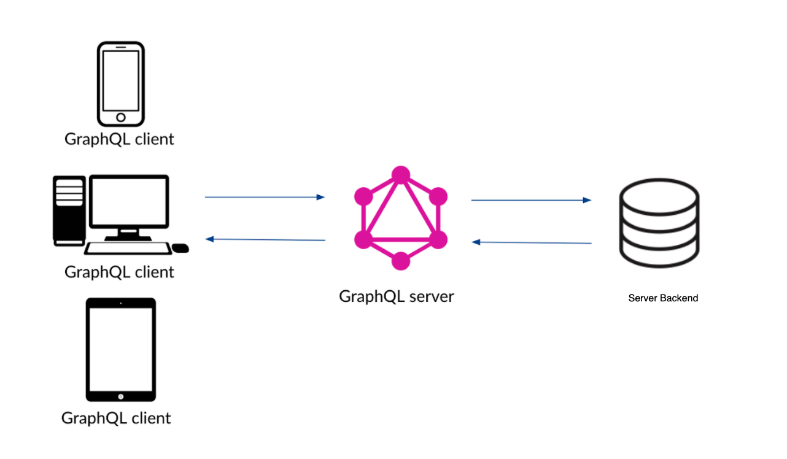
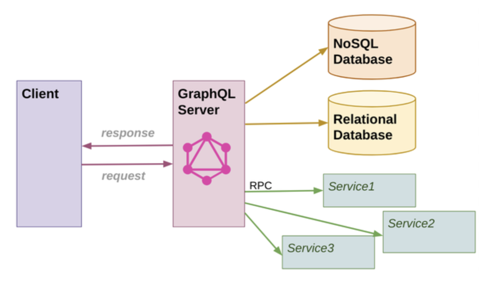

# GraphQL vs Rest: 

Rest has everything revolving around resources. Author argues that the way we build apps has  changed drastically in last 2 decades. We have moved from multi-page  server side  rendered apps to single page browser rendered  web apps.
So the way we work with client server interactions should also change.

&nbsp;
## Problems with Rest and the need for GraphQL: 

In a typical ReST based app, we can have multiple resources we want to fetch from the server to show up entire web page. Each of these resources will require their own HTTP request. On a poor network, these many parallel requests, and their separate responses, can choke down the network bandwidth causing poor performance.

GraphQL aims to solve this by consolidating all the resource requirements into one single request to the server. Correspondingly, the server will also send back one response containing all the data that is needed by the web app.

In addition to it's above innovation, GraphQL has evolved with following features:

1. Less Chatty - See above
2. Discoverable - Provides developers a great way to self-discover the capabilities of an API
3. No Overfetching/Underfetching
4. Faster Developement 
5. Less Serverside Code - Since GraphQL has a strong type system, no malformed queries are sent to the server, allowing for removal of validations.
6. Avoids N+1 problem

&nbsp;
## GraphQL is two things: 

1. A query language for your web apps to communicate with the server in client-server paradigm. These queries are created/located in the view related code of your webapp. These queries have to be specifically allowed by GraphQL Server to run, so that no bad actor can run a malformed query, as is the case with SQL queries.

2. A runtime that runs the aforementioned queries. Sits in front of the server and checks if queries are valid or not. Will return an error message if the query is malformed and the server side logic is never called. Should not have much business logic and should only check if queries are correctly formed/allowed to run.


&nbsp;


&nbsp;
## Steps to create a GraphQL Server:

1. Create an index.js file to define fields that we wish to be exposed by our GraphQL server, and the corresponding datatypes for these fields. This can be done in imperative or declarative manner. ``const typeDefs = `...` ``
2. Create one or  more resolver functions to service the GraphQL requests. There is a one to one relationship between each field in a query and a resolver function. `const resolvers = {...}`
3. Bind type defs and resolver functions using graphql-tools library into a formal GraphQL Schema. `const schema = //graphql-tools`
4. Execute queries against schema using graphql libraries. `graphql(schema, query)`

&nbsp;
## Types in GraphQL:

A fields type in graphQL can be of two types:

1. Scalar Types: These are the primitive types like String, Integer, Boolean, Float etc. These cannot be broken down into something simpler.

2. Object Types: These are complex types which represent a custom object that you want to fetch from the server. They are composed of one or more other fields. These can be broken down into sub-fields (that the type is composed of).

While constructing a query, we don't need to provide a sub-selection for scalar types, but do need to provide it for object types

Note: GraphQL has a strongly typed system

Query to see all schema types in a GraphQL server:

```
    query SchemaTypes {
        __schema{
            types{
                kind
                name
                interfaces {
                    name
                    description
                }
            }
        }
    }
```

*`! at the end of a type means that it is non-nullable. So a successful response will always have a value for that field`*

&nbsp;
## Query Parameters:

Query parmeters allow us to fetch responses that conform to a specified criteria. These can be added to the query by passing values to a set of fields in the following manner:

```
    query {
        reviews(status:APPROVED) {
            rating
            comment
            status
            user {
                firstName
                lastName
            }
        }
    }
```

*`As is the case with types in response, an ! at the end of the type means that the param must be passed while querying`*

&nbsp;
## Variables:

Query variables allow us to dynamically provide query params to a graphQl query. If we wish to use a variable in a query, we need to provide it to our query as follows

 ```
    query ModeratorReviews ($status:[ReviewStatus!]]) {
        reviews(status: $status) {
            rating
            comment
            status
        }
    }
 ```
Note that we have to provide the type of the variable, conforming to the type of the field for which it's supposed to be passed as a parameter. 

 *`Here ModeratorReviews is the name given to the query, also known as operation name. "query" is the operation type`*

Example: 
```
    query BooksQuery($page:Int, $first:Int) {
        books(page: $page, first: $first) {
            id
            title
            pageCount
            rating
        }
    }
```

&nbsp;
## Interfaces:

Interface types define a set of common fields that can be inherited by other object types. Implementing an interface type in an object guarentees the presence of the fields defined in the interface type, in the object type that implemented it. 

From a data perspective, after implementing interface types, one can think of corresponding object types as a specific use case of the more generic interface type.

&nbsp;
## Aliases and Fragments:

If a query requests for two fields that have the same name, we must use aliases to distinguish them in the JSON response returned by the GraphQL server.

Example query with duplicate fields which will result in an error: 
```
    query TwoBooks {
        book(id: 1) {
            title
            subtitle
            description
            pageCount
            rating
        }
        book(id: 2) {
            title
            subtitle
            description
            pageCount
            rating
        }
    }
```

Add aliases to fix:
```
    query TwoBooks {
        book1: book(id: 1) {
            title
            subtitle
            description
            pageCount
            rating
        }
        book2: book(id: 2) {
            title
            subtitle
            description
            pageCount
            rating
        }
    }
```

The JSON response will now have two fields names `book1` and `book2`.

Also note how we have to specify same set of fields twice. This redundancy can be fixed by using fragments. 

Fragments are a list of fields for a specific type. Although this sounds similar to an interface it's quite different. An *`Interface is a list of fields implemeted by one or more types`* whereas a *`Fragment is a list of fields for a specific type`*. Furthermore, an *`Interface is used for modelling an API on the server`*, whereas a *`Fragment is used to consume an API on client side`*.

Creating Fragments:

```
    fragment SomeFragmentName on Book {
        id
        title
    }
```

Using fragments:

Fragments are used with spread operators:
```
    books {
        ...SomeFragmentName
    }
```

&nbsp;
## Union Types:

A union type is a type that represents values from one of several possible object types. For each kind of type you want to be returned by the union type, we can provide inline fragments for each type along with the fields that are need for that type.

```
    query SearchQuery {
        search(term: "Dan") {
            __typename                      # special field that denotes the currrent object type
            ... on Book {                   # an inline fragment
                title
                subtitle
                authors {
                    firstName
                    lastName
                }
            }
            ... on Author {
                firstName
                lastName
                books {
                    title
                }
            }
            ... on User {
                firstName
                lastName
                reviews {
                    book {
                    title
                    }
                }
            }
            ... on Review {
                rating
                comment
                book {
                    title
                }
            }
        }
    }

```

&nbsp;
## Directives:

Directives allow us to selectively modify a query based on a boolean value. Although one can define their own custom directives, all GraphlQl servers should support the following two directives, as they are part of the GraphQl spec

`@include(if: someBooleanValue)`

`@skip(if: someBooleanValue)`

```
    query BookReviews($status: [ReviewStatus!], $includeUser: Boolean!) {
        reviews(status: $status) {
            id
            status
            comment
            rating
            user @include(if: $includeUser) {
                firstName
                lastName
            }
        }
    }
```

&nbsp;
## Mutations:

Mutation is the second root type other than query that allows you to modify the data on the server. In other words, mutations are used for `create`, `update` and `delete`.

```
    mutation AddBook{
        addBook(title: "", subtitle: "", description: "", pageCount: "", ...) {
            ...
        }
    }
```

Since it's unwieldly to have all of these parameters inline, we can use input types to define a JSON object containing all  the parameter, which can then be passed to the mutation (or to a query).

```
    $bookInput =  {
        "title": "",
        "subtitle": "",
        "description": "",
        ...
    }

    mutation AddBook{
        addbook(bookInput: $bookInput) {
            ...
        }
    }
```

Another key feature of a GraphQl mutation is that you can specify a rich selection of response fields that the server should return after the mutation.

```
    mutation AddBook{
        addBook(bookInput: $bookInput) {
            id
            title
            authors {
                firstName
                lastName
            }
        }
    }
```

It should be noted that Rest API responses are limited in this manner. For example the above query is allowing you to fetch not only the information on the newly created book record, but also related information about its author(s). If one were to do the same using Rest API, they would probably have to make more than one call, or forego the RestAPI design principles.

*`Note that the data modification functions performed by a mutation can also be done by a query, since each included field in the query just calls a resolver function on the server (similar to a RPC), and that function can have logic baked in to perform a data modification. However, this should still be avoided as all the resolver functions of a query are called in parallel, whereas all the resolver functions for each field in a mutation will be called in series, and that can prevent race conditions. Compare the calls below`*

```
    # resolver functions for each field will be called in parallel
    query {
        books { ... }
        reviews { ... }
        authors { ... }
    }

    # resolver functions for each field will be called in series
    mutation {
        addBook { ... }
        updateUser { ... }
        deleteReview { ... }
    }
```

&nbsp;
## Errors in GraphQL:

As GraphQL consolidates multiple requests into one, there can be scenarios when part of your query succeeds while the other part fails. In such cases, the response from the server will  have a `"errors"` property in adddition to `"data"` property.

This is different than typical Rest API implementations where either a request has a successful HTTP response or not (denote by the response status). In GraphQL, your HTTP response might  be 200 OK, but there still might be errors in the response.

Please note that in order for a query to be partially successful like mentioned above, it needs to be at least valid. For example, if a field in your query is invalid, as it has no recognition on the server side and no resolver function, none of the other resolvers for valid fields in your query will be called by GraphQL server and it will simply return a response with the error. In other words a partially successful query has errors in the resolver functions and the infrastucture/business logic on the actual server code, rather than the GraphQL server itself.

&nbsp;
## Querying GraphQL using JS:

We can perform graphQL queries for our front end JS framework using one of serveral GraphQL clients available. However the most popular is Apollo.

**_`Note: All graphQL queries are HTTP POST calls to a single GraphQL endpoint on the GraphQL Server. The request body contains the query, the operationName, and the variables as JSON attributes. One can check this in network calls in browser dev tools. So all the queries performed above in GraphiQL can be made using a cURL call.`_**

Example query to a graphQL server using curl:

```
    # original query in GraphiQL: 
    query BookQuery {
        book(id: 1) {
            title
            pageCount
            rating
        }
    }

    # cURL representation:

    curl -X POST -H "Content-type: application/json" -d '{"query":"{ book(id: \"1\") { title pageCount Rating } }"}' https://gql.trythen.com/graphql


```
